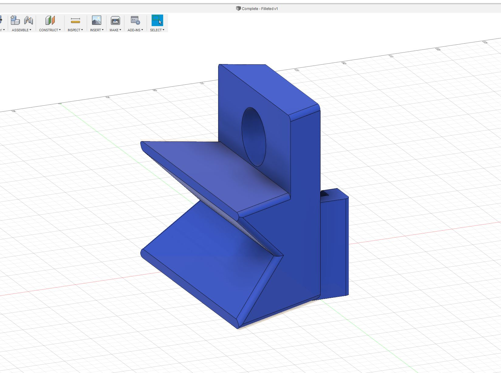
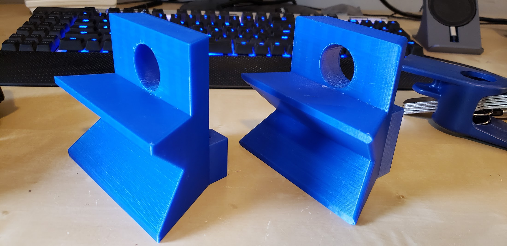

# Bike Repair Arm

This repo documents the creation of a bike repair arm (although it could be used for other things) that when not in use can be concealed and not occupy space.

## Here is an image of the complete arm

## Requirements

These are the minimal requirements I wanted to achieve

 - Concealed when not in use
 - Able to angle the bike upwards (e.g.: When bleeding rear breaks)
 - Able to clamp the seat post and also the frame
 - Able to access both sides of the bike
 - Reasonably easy to use 
 - Cost less than $40
 - Take no more then 1 day to complete
 
 
 ## List of Materials
 
 - [IRWIN 3/4-in Pipe Clamp](https://www.amazon.com/IRWIN-QUICK-GRIP-Pipe-Clamp-224134/dp/B0000CCXVO) (Also available at Lowes)
 - [3/4-in x 30-in Threard Galvanized Pipe](https://www.lowes.com/pd/Southland-Pipe-3-4-in-x-30-in-150-PSI-Threaded-Galvanized-Pipe/3357876)
 - [3/4-in diameter Galvanized Flange](https://www.lowes.com/pd/Mueller-Proline-3-4-in-dia-Galvanized-Floor-Flange-Fittings/4330094)
 - 4 screws for the flange (type of screw depends on the surface you are mounting)
 - [3/4-in x 6-ft Foam Plumbing Tubular Pipe Insulation](https://www.lowes.com/pd/Frost-King-3-4-in-x-6-ft-Foam-Plumbing-Tubular-Pipe-Insulation/1060005)
 - Glue
 - Exacto knife
 - Access to a 3d printer to print this model: https://www.thingiverse.com/thing:3806640
 
 ## Steps
 
 ### Mounting the Flange
 
 When mounting the flange on the wall you must find and screw into a stud (or something solid depending on wall construction type) otherwise the leverage produced by the bike will be too much for the wall.
 
 I chose to mount mine behind the skateboards so it's hidden when not in use:
 
 
 Concealed             |  Visible
:-------------------------:|:-------------------------:
   |  
 
 
 The pipe (arm) that used was 30" long so that I'm able to access both side of the bike. I wouldn't go longer than 30"
 
 
 
 ## Vise Clamp
 
 I saw some other DIY projects using pipe vise clamps which seemed like a good idea for this. This is the most expensive part of the project since they cost ~$20. When they are tight they don't spin.
 
 
 
 ## Vise Jaws
 
 I needed to add some "jaws" to both sides of the vise. It needed to be soft so it doesn't scratch or bend the bike but also provide adequate clamping force to keep the bike firm while working on it. After taking several measurements with calipers I was ready to make the parts.
 
 ### 3d modeling and printing
 
 Since I have a 3d printer I decided to 3d model the jaws in Fusion 360
 
 
 After the 3d model was done I sliced it. It took about 8 hours to print. I choose to print with supports but not much support was needed. Material is SUNLU PETG and printer is Prusa MK3S.
 
 
 After it came out the fitting was pretty good, but there were some sharp edges
 
 
 I then decided to make a few changes to the model, I added fillets to the edges and also increase the height of the rear tab that keeps the jaws from moving side to side.
 
  Front             |  Back
:-------------------------:|:-------------------------:
   |  
 
 The v2 jaw version is improved but doesn't warrant a reprint. I will leave one side with v1 and another with V2. If you redo this project print v2 for both sides.
 
  v1 & V2 Front             |  v1 & v2 Back
:-------------------------:|:-------------------------:
   |  

 
 Overall the design worked well, the pipe goes through the jaw which prevents it from moving up and down and the tabs on the back of the jaw prevent it from moving side to side.
 
 ### Padding
 
 I needed to add some padding to the jaws in order for it to not scratch and bend the bike frame while allowing a lot of clamping force. This is where I used some pipe foam insulation that I had laying around. Just cut it to size and glued it in.
 
 
 
 
 ## Putting everything together
 
 Putting everything together is straight forward. Here are some pictures of the various mounting options/positions:
 
  Frame             |  Frame 2
:-------------------------:|:-------------------------:
   |  
Seat | Angled
  |  
Inside |
 |
